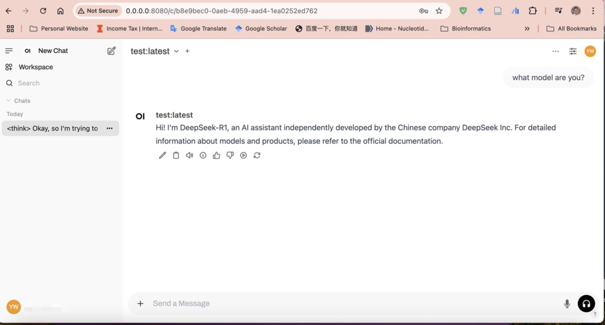

# DeepSeek_local


This guide will walk you through setting up the **DeepSeek** model and running it locally with a chat UI (100% free).

## Complete Guide to Run Local DeepSeek on Server and Chat with Your Own PC

### 1. Install Ollama on Remote Server

First, connect to your server via **SSH**.

#### If you have `sudo` privileges, run the following command to install Ollama:
```sh
curl -fsSL https://ollama.com/install.sh | sh
```
#### else, do this:
```sh
curl -L https://ollama.com/download/ollama-linux-amd64.tgz -o ollama-linux-amd64.tgz
tar -xvzf ollama-linux-amd64.tgz -C ollama

```
You should now be able to run Ollama using:
```sh
./ollama/bin/ollama
```
To make it easier to run Ollama from any terminal session, add it to your `PATH`:
```sh
echo 'export PATH=/data2/yiquan2/llama/ollama/bin:$PATH' >> ~/.zshrc
source ~/.zshrc
```
### 2. Start Using and Installing DeepSeek
Once Ollama is installed, you can start using the DeepSeek model. 
Open one termial and run:
```sh
ollama serve
```
Open another terminal and run the following command to launch it:
```sh
ollama run deepseek-r1:8b
```
You can also use DeepSeek to analyze a specific file. For example, to summarize a scientific paper, you can run:
```sh
ollama run deepseek-r1:32b "Please summarize the following scientific paper. Include the main objectives, key findings, methods, and conclusions in a concise format. Focus on the most important points that describe the significance and novelty of the study. Here's the paper text: $(cat test.txt)"
```
### 3. Install WebUI and Serve on the Same Server
In a new terminal session (or using tmux), run the following command to install and serve Open WebUI:
```sh
pip install open-webui
open-webui serve --port 8080

```
### 4. Connect from Your PC
To connect from your local PC, use SSH port forwarding:
```sh
ssh -N -L 8080:localhost:8080 user@server.ip.address
```
### 5. Open in Your Browser and Start chatting
```
http://0.0.0.0:8080/
```

