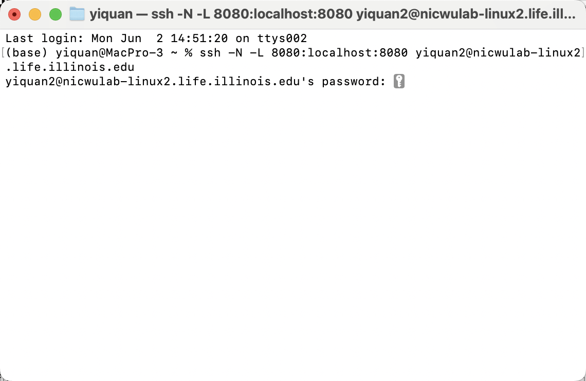
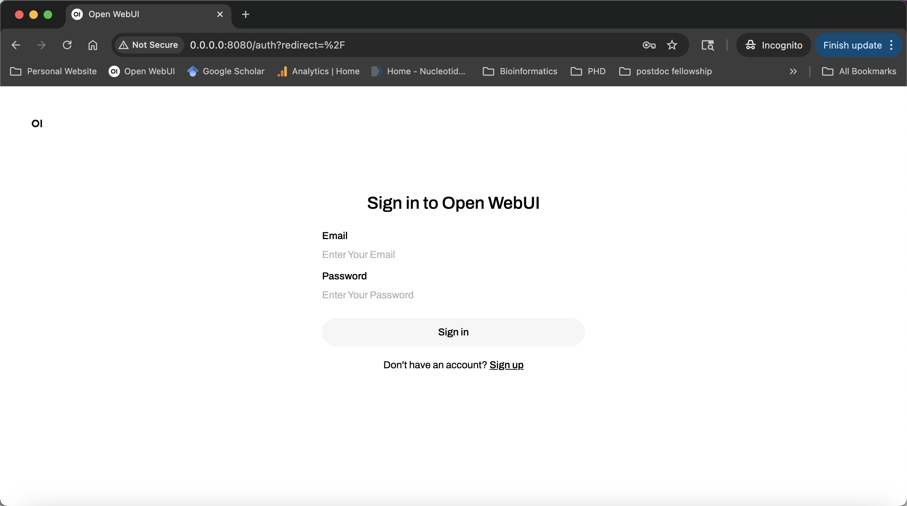
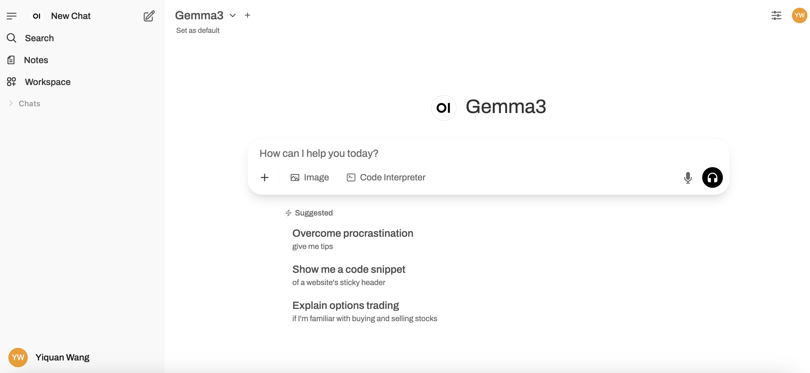

# Local LLM Usage Guide

This guide outlines the steps to access and utilize the local LLM.

## Prerequisites

*   SSH client.
*   Chrome browser.

## Steps

**Step 1: SSH Connection**

Connect to the remote server using the following command:

```bash
ssh -N -L 8080:localhost:8080 user_id@nicwulab-linux2.life.illinois.edu
```

**Step 2: Access the Web Interface**

Open Chrome and navigate to: http://0.0.0.0:8080/



**Step 3: Account Registration**

Sign up for a new account via the provided registration form.

Account Registration

**Step 4: Start Chatting**

Log in and begin interacting with the LLM. 



**Examples**

Refer to the examples provided within the interface to explore available functionalities.

[PDF Question Answering](./Paper%20PDF%20Q&A.pdf): Allows you to ask questions based on the content of a PDF research paper.

[Paper Text to Slides](./Paper%20Text%20toSlides.pdf): Generates presentation slides from the text of a research paper.

[Scientific Image Generation](./Scientific%20Image%20Generation.pdf): Creates scientific images based on provided prompts or data.

[Figure to Codes](./Figure%20to%20Codes.pdf): Transforms figures or diagrams into corresponding code snippets.
